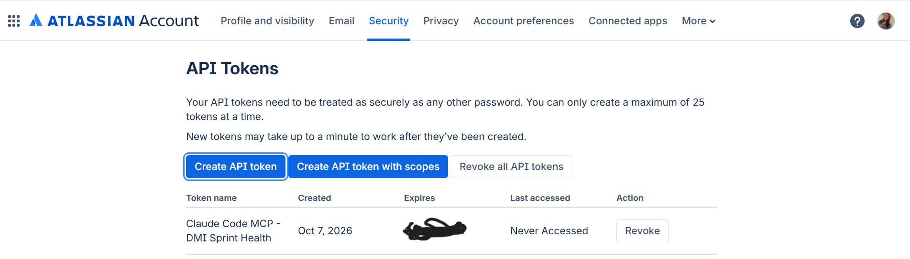
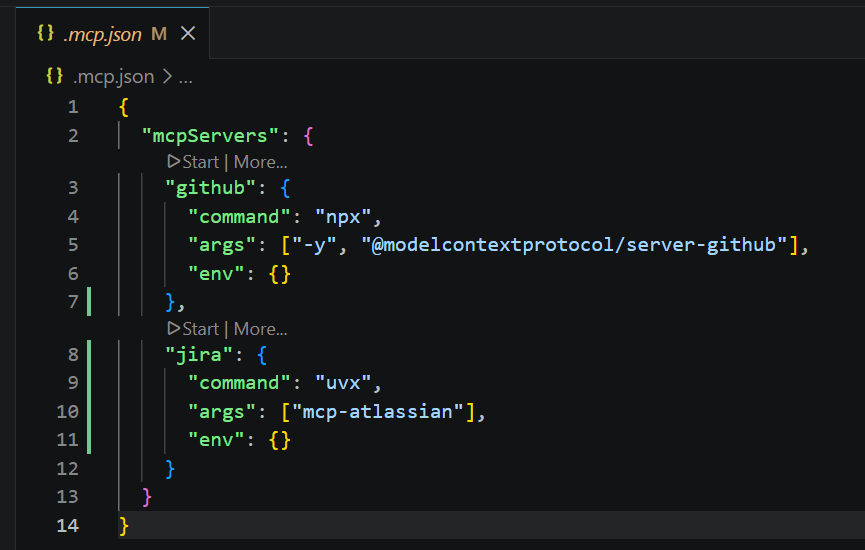
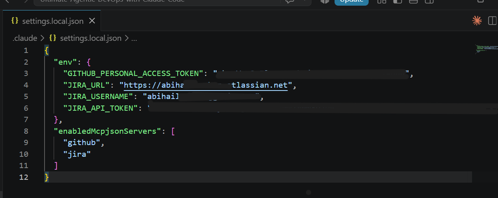
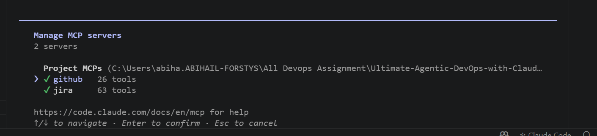
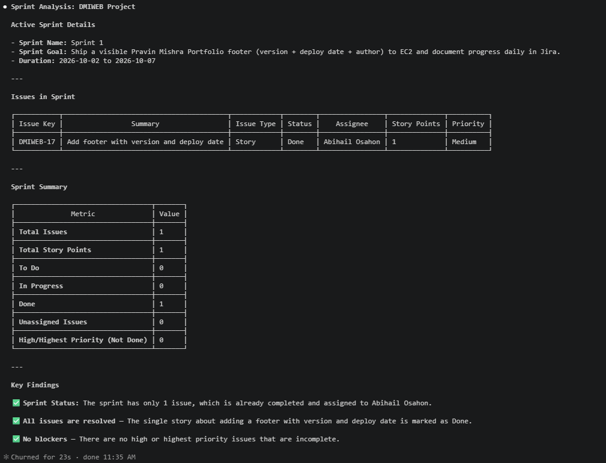
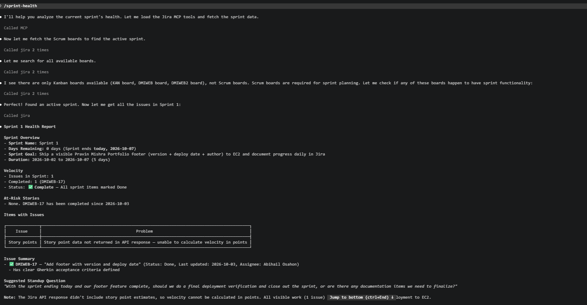
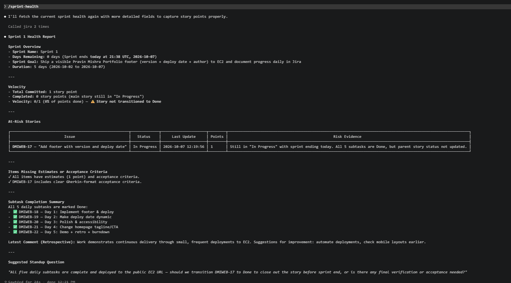

# Assignment 5 — AI-Assisted Sprint Health Report via Jira MCP

Part of the DevOps Micro Internship (DMI) Cohort 3 with Agentic AI

---

## Purpose

In this assignment, you will connect Claude Code to your Jira board through an MCP server, the same way you connected it to GitHub in Week 2, and build a read-only `/sprint-health` skill. The skill reads your current sprint through Jira's API and reports sprint velocity, stories at risk of missing the sprint, and items missing an estimate — but it must never create, edit, comment on, or transition a single ticket itself. You will prove that boundary holds by making a real change on the board yourself and confirming the skill only ever reports, never acts.

---

# Task 1 — Create a Jira API Token

## Goal

Generate an API token from your Atlassian account that the MCP server will use to authenticate with your Jira site. Do not screenshot the token value itself.

### Evidence

#### Screenshot 1 — Jira API token creation confirmation page showing the token name, with the token value not visible

### Notes You Must Write (Very Important):

Why does the MCP server need your site URL and account email in addition to the token?

The Jira site URL tells MCP which Jira instance to connect to, while the account email identifies the Atlassian account associated with the API token. The API token provides the authentication credential needed to access Jira.

---

# Task 2 — Create .mcp.json at the Project Root

## Goal

Create or update `.mcp.json` at your project root with a Jira MCP server block, following the same shape as the GitHub MCP server you configured in Week 2.

### Evidence

#### Screenshot 2 — `.mcp.json` open in VS Code showing the Jira server configuration

### Notes You Must Write (Very Important):

Compare this jira block to the github block from Week 2 Assignment 5. The GitHub server ran via npx (a Node.js package); this one runs via uvx (a Python package) — what stays exactly the same shape despite that difference, and why doesn't Claude Code care which language a given MCP server is written in?

**What stays the same:** Both the `github` and `jira` blocks have the same three fields: `command` (the program that launches the server), `args` (what to pass it), and `env` (environment variables, left empty because secrets live in `settings.local.json`). Only the values differ: `npx` with a Node package for GitHub, and `uvx` with a Python package for Jira.

**Why Claude Code doesn't care about the language:** Claude Code only starts the process named in `command` and talks to it over MCP, a standard protocol for listing and calling tools. As long as the server speaks MCP, it makes no difference whether it was written in Node.js, Python or anything else. `npx` and `uvx` are simply different launchers for the same kind of server.

---

# Task 3 — Add Your Credentials to settings.local.json

## Goal

Add your Jira site URL, account email, and API token to `.claude/settings.local.json`, and confirm that file is listed in `.gitignore` so it is never committed.

### Evidence

#### Screenshot 3 — `settings.local.json` open in VS Code showing the `env` section, with the actual token value blurred or covered

### Notes You Must Write (Very Important):

Why must JIRA_API_TOKEN live in settings.local.json and never in .mcp.json?

`.mcp.json` is a shared project file that is committed to Git and pushed to GitHub, so anything in it is visible to anyone with the repo. `settings.local.json` is gitignored and stays on my machine only. The API token acts like a password for my Jira account, so it must live in the local file. If it were in `.mcp.json`, it would be published, and anyone could read or change my Jira data until I revoked it.

---

# Task 4 — Verify the Connection with /mcp

## Goal

Restart Claude Code and confirm the Jira MCP server shows as connected.

### Evidence

#### Screenshot 4 — `/mcp` output showing `jira: connected`

---

# Task 5 — Run a Live Query to Prove Real Board Data

## Goal

Ask Claude to list the issues in your current active sprint through the Jira MCP connection, and confirm the result matches what you see on your live board in the browser.

### Evidence

#### Screenshot 5 — Claude's response showing the live sprint issue list retrieved via Jira MCP

### Notes You Must Write (Very Important):

How did you confirm this was real board data and not something Claude guessed?

I opened the same sprint in my browser and compared it with Claude's output. The sprint name, goal, dates, the Story key DMIWEB-17, its Done status, 1 story point and my name as assignee all matched the live board. The details are specific to my own board, including the exact Sprint Goal wording I typed in Jira, which Claude could not have known from training data. Claude also ran Jira MCP tool calls before answering, so the answer came from the live API. The one difference I noticed is that the report listed only the Story and not its five sub-tasks, so I know the query counted top-level issues only.

---

# Task 6 — Build the /sprint-health Skill

## Goal

Create a `/sprint-health` skill restricted to read-only Jira tools plus `Read`, with no issue-mutating tools and no `Write`. Run it and confirm it produces a report covering sprint velocity, at-risk stories, and items missing an estimate.

### Evidence

#### Screenshot 6 — `SKILL.md` frontmatter showing `allowed-tools` limited to read-only Jira tools plus `Read`, with `disable-model-invocation: true`

1[skillsmd allowed tools](./screenshots/ass5task6m1.png)

#### Screenshot 7 — `/sprint-health` output showing the full triage report against your real sprint

### Notes You Must Write (Very Important):

1. Which Jira MCP tools does this skill's allowed-tools list include, and which mutating tools (create issue, update issue, transition issue, add comment) does it deliberately exclude?

The skill allows only read tools: `jira_search`, `jira_get_issue`, `jira_get_sprint` and `jira_get_board`, plus `Read` for local files. It deliberately excludes every tool that changes the board: creating an issue, updating an issue, transitioning an issue and adding a comment. It also excludes `Write`, so it can't write files.

2. Why does a Scrum Master need this restriction more than almost any other role in this course?

The Scrum Master is accountable for the board and for the team's transparency. If an AI silently moved, edited or closed tickets, the board would no longer reflect decisions the team actually made, and nobody could trust it. By keeping the skill read-only, it can flag risks while the human Scrum Master decides and acts.

---

# Task 7 — Prove the Skill Never Mutates the Board

## Goal

Manually update one ticket on your board in the browser (for example, move a story to "Done" or add a missing estimate), then run `/sprint-health` again and confirm the new report reflects your change — proving the skill only ever reads live state and never wrote to the board itself.

### Evidence

#### Screenshot 8 — Second `/sprint-health` run showing the report now reflects your manual board change

### Notes You Must Write (Very Important):

Map this assignment to Gather → Analyze → Human Act → Verify from Week 3 Assignment 6. Which step did you perform manually in the browser, and why must that step stay human?

- **Gather:** The Jira MCP server read my live sprint data from the board.

- **Analyze:** The /sprint-health skill calculated velocity and flagged at-risk stories from that data.

- **Human Act:** I moved DMIWEB-17 from Done to In Progress myself in my browser. This is the step I did manually.

- **Verify:** I ran /sprint-health again. The report showed DMIWEB-17 as In Progress and velocity at 0/1, so it was reading the live board.

**Why the Human Act step must stay human:** Changing a ticket's status is a decision about the team's work, and the Scrum Master is accountable for it. If the AI could move tickets on its own, the board might no longer reflect what the team decided, and nobody would know who was responsible for the change.

---

# Submission Instructions

Complete all tasks in sequence.

Your submission must include:
- All 8 required screenshots
- All the required notes

---

# Completion Checklist

- [ ] Task 1: Jira API token created, value never screenshotted (Screenshot 1)
- [ ] Task 2: `.mcp.json` has the Jira server block (Screenshot 2)
- [ ] Task 3: Credentials stored in `settings.local.json`, token blurred, file gitignored (Screenshot 3)
- [ ] Task 4: `/mcp` shows the Jira server connected (Screenshot 4)
- [ ] Task 5: Live query returned real sprint data, verified against the browser (Screenshot 5)
- [ ] Task 6: `/sprint-health` skill created with correct read-only `allowed-tools`, and produced a full report (Screenshots 6–7)
- [ ] Task 7: A manual board change was reflected in a second `/sprint-health` run (Screenshot 8)
- [ ] Skill never created, edited, transitioned, or commented on any issue
- [ ] Reflection answered (Notes)
- [ ] No API token value exposed

---

## 📌 About DMI & CloudAdvisory

DevOps Micro Internship (DMI) is a project-based DevOps program run by Pravin Mishra (The CloudAdvisory) focused on real-world execution, systems thinking, and career readiness.

It helps learners build strong DevOps foundations with hands-on experience.

---

## 📌 Resources

- 🌐 DMI Official Website: https://dmi.pravinmishra.com?utm_source=github&utm_medium=readme  
- 🎓 University: https://university.pravinmishra.com?utm_source=github&utm_medium=readme  
- 💬 Discord Community: https://discord.pravinmishra.com?utm_source=github&utm_medium=readme  
- 📝 Blog: https://dmi.pravinmishra.com/blog?utm_source=github&utm_medium=readme  
- ▶️ YouTube Playlist: https://www.youtube.com/playlist?list=PLFeSNDtI4Cho  
- 🔗 Pravin Mishra (LinkedIn): https://www.linkedin.com/in/pravin-mishra-aws-trainer/  
- 🏢 CloudAdvisory (LinkedIn): https://www.linkedin.com/company/thecloudadvisory/

---

*This submission is part of DevOps Micro Internship (DMI) Cohort 3 — Agentic AI Track.*
